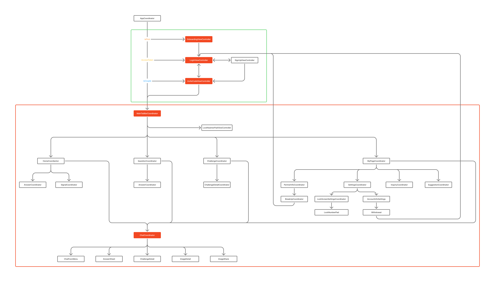
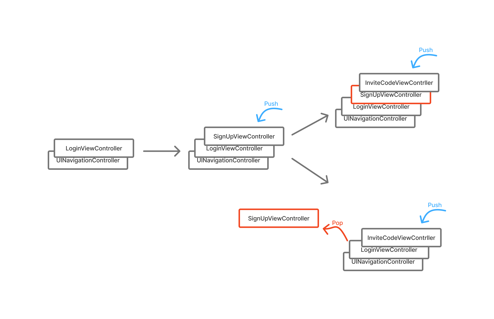

# 필로우톡(FeelTalk)

## Teck Stack

## 1. Architecture 

### 1.1 Clean Architecture
Clean Architecture 원칙과 MVVM 패턴을 따릅니다.

* 실제 폴더 구조가 아닌 Xcode 그룹 사용으로 프로젝트 구성을 관리합니다.

### 1.2 MVVM with RxSwift
#### Why? 
기존 UIKit 기반 구조에서는 ViewController가 지나치게 비대(Massive ViewController)해지는 문제가 반복적으로 발생했습니다. 단일 클래스에 UI로직과 비즈니스 로직이 모두 집중되면서 가독성와 유지보수성이 저하되고, 강한 결합으로 인해 재사용성 또한 떨어졌습니다. 이러한 문제를 해결하고 책임을 명확히 분리하기 위해 MVVM 패턴을 도입했습니다.

하지만 UIKit 환경은 사용자 입력, UI 업데이트, 네트워크 응답 등 서로 다른 성격의 비동기 이벤트를 Delegate, Closure, Notification 등 여러 방식으로 처리해야 한다는 구조적 한계가 있었습니다. 이로 인해 이벤트 흐름을 일관된 패턴으로 유지하기 어렵고, 데이터 바인딩 로직이 다시 ViewController로 모여 Massive ViewController로 회귀할 가능성이 있다고 판단했습니다.

RxSwift는 이러한 이슈를 해결하기 위해 이벤트를 단일한 스트림 기반으로 통합하고, View와 ViewModel 간의 바인딩을 일관될 방식으로 구성할 수 있게 해줍니다. 이에 따라 본 프로젝트는 MVVM 아키텍처의 완성도를 높이고 비동기 호름을 명확하게 관리하기 위해 RxSwift를 도입했습니다. 

#### How?
#### 1.2.1 Input/Output 패턴 적용
데이터 흐름을 명확히 정의하고, ViewModel의 역할을 입력을 받아 출력을 만드는 순수 함수로 규정하기 위해 Input/Output 패턴을 도입했습니다.

프로젝트 내 모든 ViewModel은 다음과 같은 표준화된 구조를 따릅니다.
* Input: View(사용자)로부터 ViewModel로 흘러 들어가는 이벤트 스트림
* Output: ViewModel에서 비즈니스 로직 처리 후 View로 다시 흘러나와 UI를 업데이트하는 상태 스트림
* transform(input:) 메서드: Input을 받아서 Output으로 변환하는 핵심 비즈니스 로직이 구현된 메서드

```Swift
final class ChallengeDetailViewModel {
    let modelObserver = ReplayRelay<Callenge>.create(bufferSize: 1)
    ...

    private let viewTypeObserver = PublishRelay<ChallengeDetailViewType>()
    private let title = BehaviorRelay<String>(value: "")
    private let disposeBag = DisposeBag()
    ...

    struct Input {
        let viewWillAppear: Observable<Bool>
        ...
    }

    struct Output {
        let titleModel = PublishRelay<String>()
        let deadlineModel = PublishRelay<String>()
        let contentModel = PublishRelay<String>()
        ...
    }

    func transfrom(input: Input) -> Output {
        let output = Output()

        // 초기 화면 설정
        input.viewWillAppear
            .take(1)
            .asObservable()
            .withLatestFrom(modelObserver) {  
                title: $1.title, 
                deadline: $1.deadline,
                content: $1.content,
                isCompleted: $1.isCompleted
            }.withUnretained(self)
            .bind { vm, model in
                guard let title = model.title,
                      let deadline = model.deadline,
                      let content = model.content,
                      let isCompleted = model.isCompleted else { return vm.viewTypeObserver.accept(.new) }  // model이 없으면 등록 화면 랜더링

                isCompleted ? vm.viewTypeObserver.accept(.completed) : vm.typeObserver.accept(.ongoing) // isCompleted 상태에 따른 완료, 진행 화면 랜더링

                vm.title.accept(title)
                output.titleModel.accept(title)
                output.deadlineModel.accept(deadline)
                output.contentModel.accept(content)
            }.disposed(by: disposeBag)

        ...

        return output
    }
}
```

#### 1.2.2 Reactive Extension
프로젝트에서는 UIViewController의 생명주기(Lifecycle)를 Rx 기반으로 다룰 수 있도록 Reactive Extension을 직접 구현하여 사용하고 있습니다. 기존의 viewViewDidLoad, viewWillAppear 등의 생명주기 이벤트는 보통 override를 통해 처리하게 됩니다. 하지만 이러한 방식은 ViewController 내부 로직을 비대하게 만들고, 여러 ViewModel 또는 외부 객체에서 해당 이벤트를 구독해야 할 때 구조가 복잡해지는 문제가 있습니다.

이를 해결하게 위해 UIViewController의 생명주기 메서드를 Rx의 ControlEvent로 래핑하는 Reactive Extension을 도입했습니다 이 접근 방식은 다음과 같은 장점을 제공합니다.
1. 생명주기를 스트림 형태로 동작시켜 ViewModel 또는 다른 레이어에서 쉽게 구동 가능
2. ViewController의 책임을 줄여 Massive ViewController 문제 완화
3. 동일한 패턴을 여러 화면에 반복 적용 가능

```swift
extension Reactive where Base: UIViewController {
    var viewDidLoad: ControlEvent<Void> {
        let source = methodInvoked(#selector(Base.viewDidLoad)).map { _ in }

        return ControlEvent(events: source)
    }
    
    var viewWillAppear: ControlEvent<Bool> {
        let source = methodInvoked(#selector(Base.viewWillAppear)).map { $0.first as? Bool ?? false }

        return ControlEvent(events: source)
    }
    
    var viewDidAppear: ControlEvent<Bool> {
        let source = methodInvoked(#selector(Base.viewDidAppear)).map { $0.first as? Bool ?? false }

        return ControlEvent(events: source)
    }
    
    var viewWillDisappear: ControlEvent<Bool> {
        let source = methodInvoked(#selector(Base.viewWillDisappear)).map { $0.first as? Bool ?? false }

        return ControlEvent(events: source)
    }
    
    var viewDidDisappear: ControlEvent<Bool> {
        let source = methodInvoked(#selector(Base.viewDidDisappear)).map { $0.first as? Bool ?? false }

        return ControlEvent(events: source)
    }
}
```

#### 1.2.3 메모리 관리 및 DisposeBag 사용
RxSwift에서 Observable 시퀀스에 subscribe() 하여 작업을 시작하면, 명시적으로 구독을 중지하거나 완료 이벤트를 받기 전까지 계속 활성화 상태로 유지됩니다. 이는 메모리 누수(Memory Leak)이어질 수 있습니다. disposeBag은 이러한 구독을 담아두는 구독 취소 컨테이너 역할을 합니다.

본 프로젝트는 주로 ViewController나 ViewModel과 같은 클래스 내부에 다음과 같은 형태로 인스턴스를 선언합니다.

```Swift
import RxSwift

final class ChallengeViewModel {
    private let disposeBag = DisposeBag()

    func transform(input: Input) -> Output {
        input.isPagination
            .distinctUntilChanged()
            .filter { $0 }
            .withLatestFrom(currentDisplayCell)
            .filter { $0 == .ongoing }
            .withLatestFrom(currentOngoingChallengePageNo)
            .filter { $0 > 0 }
            .map { $0 - 1 }
            .bind(to: currentOngoingChallengePageNo)
            .disposed(by: disposeBag)
    }
}
```

위와 같은 설계는 인스턴스(ChallengeViewModel)가 메모리에서 해제될 때, 프로퍼티로 선언된 disposeBag도 함께 해제되며, disposeBag이 해제되는 순간, 그 안에 추가되었던 모든 활성 구독이자동으로 .dispose()되어 메모리 관리를 안전하고 효율적으로 유지할 수 있습니다.

#### 1.2.4 순환 참조 방지 및 withUnretained 사용
RxSwift를 사용할 때 클래스 내부에서 자신의 메소드를 Observable 클로저 내부에 참조할 때 강한 순환 참조가 자주 발생합니다. 이 문제를 해결하기 위해 Swift에서는 [weak self] 또는 [unowned self]를 사용하지만, RxSwift를 도입한 본 프로젝트에서는 이보다 더 안전하고 간결한 방법인 withUnretained 연산자를 지향합니다.

withUnretained 연산자는 다음 두 가지 이점을 제공합니다.
1. 자동 약한 참조: 대상 객체(self)를 자동으로 weak 로 캡처합니다.
2. 안전한 언래핑 및 스트림 중단
   1. 클로저 실행 시점에 객체가 메모리에 존재하면 (Unretained<Self>, Element) 튜플로 반환되어 안전하게 접근할 수 있습니다.
   2. 만약 객체가 이미 해제되었다면, 해당 Observable 스트림 이벤트가 자동으로 무시(필터링)되어 크래시를 방지합니다.

```Swift
currentOngoingChallengePageNo
    .withUnretained(self)
    .bind { vm, pageNo in
        vm.challengeUseCase.getChallengeList(type: .ongoing, pageNo: pageNo)
            .bind(to: vm.ongoingChallengeModelList)
            .disposed(by: vm.disposeBag)
    }.disposed(by: disposeBag)
```

### 1.3. Coordinator Pattern
#### Why?
필로우톡은 Massive ViewController 문제를 해결하기 위해 MVVM 아키텍처를 도입했습니다. 그러나 여전히 화면(View)을 담당하는 ViewController에 화면 전환(Flow) 로직이 포함되어, Massive ViewController 문제를 완전히 해소하지는 못했습니다.   

또한 ParentViewController가 ChildViewController를 직접 참조하며 화면 전환을 수행하는 구조로 인해, 두 ViewController 간의 의존성이 높아지는 문제가 존재했습니다. 이러한 문제를 해결하기 위해, 화면 전환(Flow) 로직을 ViewController로부터 분리할 수 있는 Coordiantor Pattern 을 적용했습니다.

#### How?
#### 1.3.1 시스템 플로우 관리

필로우톡의 화면 전환에는 크게 두 가지(<font color= "green">로그인, 회원가입</font>, <font color= "red">FeelTalk 메인 서비스</font>) 플로우가 존재합니다.</br>
각각의 플로우 RootViewController가 UINavigationController에 Push 되는 시점은 첫 실행, AccessToken 유/무, 커플 여부에 따라 다르므로 각 케이스를 분기처리 하여 사용자 상태에 따른 화면 전환을 구현했습니다.

#### 1.3.2 TabBarCoordinator
프로젝트에서는 전체 화면 구조의 중심이 되는 탭 기반 UI를 구현하기 위해 TabbarCoordinator 패턴을 도입했습니다. 기존의 방식처럼 UITabBarController에서 탭 전환 로직을 직접 처리하는 방식은 화면 전환 책임이 UITabBarController 내부로 몰리며 유지보수가 어려워지는 문제가 있었습니다. 특히, 탭 구성 요소가 여러 모듈로 나뉘어지고, 각 탭마다 독립적인 네비게이션 흐름을 갖는 경우 이러한 문제는 더욱 심각해집니다.

이를 해결하기 위해 TabBarCoordinator를 도입하여 탭 구조 관리, 초기 화면 설정, 탭 간 독립적인 Navigation 흐름 구성 등을 UITabBarController에서 완전히 분리했습니다.

* 탭은 TabBarPage enum으로 정의되며, 각 탭은 아래 정보를 하나의 타입으로 보관합니다. 이를 통해 TabBar의 UI 정보가 분산되지 않고 단일 구조(enum)안에서 관리되며 확장성도 확보합니다.
```Swift
enum TabBarPage: String, CaseIterable {
    case home, question, challenge, myPage
    
    func toTitle() -> String { ... }                // 탭 타이틀
    func pageOfNumber() -> Int { ... }              // 탭별 인덱스
    func toIconName() -> String { ... }             // 기본 아이콘
    func toSelectedIconName() -> String { ... }     // 선택 아이콘
}
```

* Coordiantor는 앱 최초 구동시 start() 메서드를 통해 모든 탭의 NavigationController를 생성하고 TabBarController에 주입합니다. Coodiantor가 TabBarController 생성과 화면 초기 설정을 관리함으로써 ViewController는 UI로직만 담당하게 됩니다.

```Swift
func start() {
    let pages = TabBarPage.allCases
    let controllers = pages.map { self.createTabNavigationController(of: $0) }
    self.configureTabBarController(with: controllers)
}
```

* 탭 전환 시 기존 화면 상태가 유지되며, 탭마다 별도의 흐름(Stack)을 갖도록 각 탭은 독립적인 UINavigationController를 사용하도록 설계했습니다. 

```Swift
private func createTabNavigationController(of page: TabBarPage) -> UINavigationController {
    let tabNavigationController = UINavigationController()
    tabNavigationController.tabBarItem = self.configureTabBarItem(of: page)
    self.startTabCoordinator(of: page, to: tabNavigationController)
    return tabNavigationController
}
```

* 탭에 대응하는 Coordinator를 생성하고 각 Coordiantor가 해당 탭의 rootViewController를 관리하도록 설계했습니다.

```Swift
private func startTabCoordinator(of page: TabBarPage, to tabNavigationController: UINavigationController) {
    switch page {
    case .home:
        let homeCoordinator = DefaultHomeCoordinator(tabNavigationController)
        homeCoordinator.start()
        childCoordinators.append(homeCoordinator)

    case .question:
        let questionCoordinator = DefaultQuestionCoordinator(tabNavigationController)
        questionCoordinator.start()
        childCoordinators.append(questionCoordinator)

    case .challenge:
        let challengeCoordinator = DefaultChallengeCoordinator(tabNavigationController)
        challengeCoordinator.start()
        childCoordinators.append(challengeCoordinator)

    case .myPage:
        let myPageCoordinator = DefaultMyPageCoordinator(tabNavigationController)
        myPageCoordinator.start()
        childCoordinators.append(myPageCoordinator)
    }
}
```
  
#### 1.3.2 Navigation Stack 관리
회원가입 화면(SignUpViewController)에서 ‘인증 완료’ 버튼을 탭하면 서버에 회원가입 요청을 보낸 후, 커플 매칭을 위한 커플 코드 화면(InviteCodeViewController) 으로 전환됩니다.
이때 스와이프 백(Swipe Back) 제스처나 네비게이션 바의 Back 버튼으로 이전 화면으로 돌아갈 경우, 이미 회원가입이 완료되었음에도 불구하고 사용자가 입력한 정보가 남아 있는 SignUpViewController가 다시 표시되는 문제가 발생했습니다.


이는 회원가입 완료 후 불필요한 화면 복귀로 인한 UX 저하와, 이미 사용이 끝난 ViewController 및 ViewModel 인스턴스가 Heap 영역에 잔존하면서 발생할 수 있는 메모리 누수(Memory Leak) 문제를 유발할 수 있었습니다.
이를 방지하기 위해, UINavigationController의 Navigation Stack을 제어하는 로직을 추가하여 회원가입 완료 시 이전 화면을 Stack에서 제거하도록 구현했습니다.


#### 1.3.3 Child -> Parent 데이터 동기화 Trigger
ChildViewController에서 사용자가 서버 요청을 완료한 뒤 ParentViewController로 전환(Pop)될 때, 해당 작업의 결과가 ParentViewController에 제대로 동기화되지 않는 문제가 있었습니다.

기존에는 화면이 다시 나타나는 시점(viewWillAppear)에 데이터를 Reload하는 방식을 검토했지만, 다음과 같이 네트워크 오버헤드 발생 가능성이 있었습니다.

1. 사용자가 ChildViewController에서 아무 작업을 하지 않았음에도 ParentViewController의 viewWillAppear가 호출되기만 하면 불필요한 데이터 재요청 발생
2. 이미 viewDidAppar에서 초기 데이터를 불어왔음에도 viewWillAppear에서 중복 요청이 발생하여 네트워크 리소스 낭비

즉, 화면 전환 시점에서 데이터를 무조건 갱신하는 방식은 정확한 데이터 갱신 타이밍을 보장하지 못하고, 네트워크 효율성도 떨어진다는 문제가 있었습니다.

이를 해결하기 위해 ChildCoordinator -> ParentCoordinator로 이벤트를 명확하게 전달하는 Finish Delegate 패턴을 적용했습니다.

ChildCoordinator는 서버 작업이 정상적으로 완료된 시점에만 Delegate 메서드를 호출하여 ParentCoodinator에 위임하고 ParentCoordinator는 해당 ViewController의 ViewModel에 이벤트를 트리거로 필요한 시점에 데이터를 갱신하도록 구현했습니다.

```Swift
extension Coordinator {
    /// 현재 Coordinator의 Flow가 종료될 때 호출되는 메서드
    ///
    /// - childCoordiantor 배열을 모두 제거하여 메모리 누수를 방지하고, 불필요한 참조를 정리
    /// - 일반적으로 ChildViewController 또는 ViewModel에서 특정 작업이 완료되고 Pop or Dismiss 시점에 호출됨.
    func finish() { childCoordinator.removeAll() }
}
```

ChildCoordinator
```Swift
final class DefaultSignalCoordinator: Coordinator {
    var finishDelegate: CoordinatorFinishDelegate?
    var type: CoordinatorType = .signal

    func finish() {
        self.finishDelegate?.coordinatorDidFinish(childCoordinator: self)
        self.navigationController.dismiss(animated: false)
    }

    func dismiss() {
        self.childCoordinators.removeAll()
        self.navigationController.dismiss(animated: false)
        self.navigationController.tabBarController?.tabBar.isHidden = false
    }
}
```

ChildViewController의 ViewModle
```Swift
final class SignalViewModel {
    private weak var coodinator: SignalCoordinator?
    private let model = PublishRelay<Signal>()

    struct Input {
        let tapChangeSignal: Observable<Signal>
        let dismiss: Observable<Void>
    }

    func transfer(input: Input) -> Output {
        ...

        // 시그널 전송 버튼은 탭했을 떄
        input.tapChangeSignalButton
            .withLatestFrom(model)
            .withUnretained(self)
            .bind { vm, model in
                vm.signalUseCase.changeMySignal(model)  // 사용자의 현재 상태(model)를 기반으로 Signal 변경 요청
                .filter { $0 } 
                .delay(.microseconds(300), scheduler: MainSchedular.instance)   // BottomSheet가 내려가는 시간
                .bind(onNext: { _ in
                    vm.coordinator?.finish()    // Signal 변경 성공시 Coodinator의 finish() 호출 
                }).disposed(by: vm.disposeBag)
            }.disposed(by: vm.disposeBag)

        
        input.dismiss
            delay(.milliseconds(300), 
                scheduler: MainScheduler.instance)
            .withUnretained(self)
            .bind { vm, _ in
                vm.coordinator?.dismiss()
            }.disposed(by: disposedBag)

        return Output(selectedSignal: self.model)
    }
}
```
ParentCoordinator
```Swift
extension DefaultHomeCoordinator: CoordinatorFinishDelegate {
    func coordinatorDidFinish(childCoordinator: Coordinator) {
        switch childCoordinator.type {
        case .signal:
            homeViewController.viewModel.reloadObservable.accept(.signal)
        case .answer, .answered:
            homeViewController.viewModel.reloadObservable.accept(.todayQuestion)
        case .chatFromBottomSheet:
            showChatFlow()
        default:
            break
        }
        
        self.navigationController.tabBarController?.tabBar.isHidden = false
    }
}
```

## 2. Network
### 2.1 Router Pattern
#### Why?
기존 Repository 계층은 API 요청을 구성하는 Request Component(URL, HTTP Method, Parameter, …)를 여러 파일에 분산해 정의하는 방식으로 구현되어 있었습니다.<br>이러한 방식은 50개 이상의 API를 사용하는 상황에서, 엔드포인트가 지속적으로 확장되는 환경에 적합하지 않았습니다.<br>그로 인해 Request 정의의 일관성이 떨어지고, 휴먼 에러 및 유지보수 비용 증가 문제가 발생했습니다.<br>이를 해결하고자 Router Pattern을 도입하여 API 계층을 재구성했습니다.

#### How?
먼저, 모든 API가 공통적으로 준수해야 할 요청 규약을 Router Protocol로 정의해 프로젝트 전체의 엔드포인트 정의 방식을 일관되게 유지했습니다.
```Swift
public protocol Router {
    var baseURL: String { get }
    var path: String { get }
    var method: HTTPMethod { get }
    var header: [String: String] { get }
    var parameters: [String: Any]? { get }
    var encoding: ParameterEncoding? { get }
}
```

각 도메인(Challenge, Question, ...)별로 연관된 API들은 열거형(Enum)의 case로 정의했습니다.<br>이 방식은 새로운 엔드포인트 추가 시 기존 Enum과 switch 구문을 수정해야 하므로 개방-폐쇄 원칙(OCP)을 위반하지만, 다음과 같은 장점들을 고려하여 채택했습니다:

* 강력한 타입 안정성 및 명시성: 컴파일러가 누락된 케이스를 체크하여 API 정의를 안전하게 유지합니다.
* API 중앙 집중화: 도메인별 API를 단일 Enum에 모아 관리하여 응집도를 높입니다.
* 캡슐화: 연관 값(associated values)을 통해 각 요청에 필요한 데이터를 안전하게 전달합니다.

```Swift
enum ChallengeAPI {
    case addChallenge(requestDTO: AddChallengeRequestDTO)
    case completeChallenge(requestDTO: CompleteChallengeRequestDTO)
    case getChallenge(index: Int)
    case getChallengeCount
    ...
}
```

또한, URLRequestConvertible 프로토콜을 준수함으로써 Router에서 정의한 엔드포인트 정보를 실제 URLRequest로 안전하게 변환할 수 있도록 구성했습니다.<br>모든 Request Component는 Router 프로토콜에 따라 일관성 있게 정의되며, asURLRequest()에서는 이를 조합하여 최종 네트워크 요청을 생성합니다.

```Swift
extension ChallengeAPI: Router, URLRequestConvertible {
    var baseURL: String { ClonectAPI.BASE_URL }

    var path: String {
        switch self {
        case .addChallenge:
            return "/api/v1/challenge"
        ...    
        }
    }

    var method: HTTPMethod {
        switch self {
        case .addChallenge: return .post
        ...
        }
    }

    var header: [String : String] {
        switch self {
        case .addChallenge,
            ...:
            return ["Content-Type": "application/json",
                    "Accept": "application/json"]
        ...
        }
    }

    var parameters: [String : Any]? {
        switch self {
        case .addChallenge(requestDTO: let dto):
            return ["title": dto.title,
                    "deadline": dto.deadline,
                    "content": dto.content]
        ...
        }
    }

    var encoding: Alamofire.ParameterEncoding? {
        switch self {
        case .addChallenge,
            ...:
            return JSONEncoding.default
        ...
        }
    }

    func asURLRequest() throws -> URLRequest {
        let url = URL(string: baseURL + path)!
        var request = URLRequest(url: url)

        request.method = method
        request.headers = HTTPHeaders(header)
        
        if let encoding = encoding {
            return try encoding.encode(request, with: parameters)
        }
        
        return request
    }
}
```

#### Result!
이와 같은 구조를 적용하면 Repository 계층은 Request를 매번 수동으로 구성할 필요 없이, 각 API가 제공하는 URLRequestConvertible을 그대로 Alamofire(AF.request)에 전달하기만 하면 됩니다.<br>이는 네트워크 레이어의 중복 코드 제거와 Request 정의의 일관성 확보에 크게 기여했습니다.

### 2. Request Interaction
#### Why? 
필로우톡은 JWT기반 인증을 사용하며, Access Token에는 유효 기간이 존재합니다. 이 유효 기간이 짧기 떄문에 네트워크 요청 시점에 Access Token이 만료되거나 만료 직적인 경우가 빈번하게 발생합니다. 

기존 구조에서는 각 API 호출부마다 토큰 만료 여부를 체크하고 재발급 요청을 수행해야 했기 때문에 중복 코드 발생, 유지보수성 저사, 재발급 타이밍 불일치로 인한 불안전성의 문제가 있었습니다.

이를 해결하기 위해 Alamofire RequestInterceptor를 활용하여 모든 네트워크 요청 전에 토큰 상태를 자동으로 점검하고 필요한 경우 안전하게 재발급 받아 반영하는 구조를 구축했습니다.

#### How?
* adapt()에서 AccessToken 자동 갱신
  * AccessToken, 만료 시간(expiredTime)을 Keychain에서 가져옵니다.
  * 만료 시간이 1분 이하로 남았을 경우, 토큰을 재발급하는 API(LoginAPI.reissuanceAccessToken)을 호출합니다.
  * 재발급 성공시 Keychain 값을 갱신하고, 새로운 Access Token을 URLRequest의 Header에 설정합니다
  * 만료 시간이 충분하면 기존 Access Token을 그대로 사용합니다.
```Swift
final class DefaultRequestInterceptor: RequestInterceptor {
    func adapt(_ urlRequest: URLRequest, for session: Session, completion: @escaping (Result<URLRequest, Error>) -> Void) {
        let crtDateStr = Date.toString(Date())
        guard let crtAccessToken = KeychainRepository.getItem(key: "accessToken") as? String,
              let crtExpiredTime = KeychainRepository.getItem(key: "expiredTime") as? String,
              let targetDate = Date.toDate(crtExpiredTime),
              let crtDate = Date.toDate(crtDateStr) else {
            completion(.success(urlRequest))
            return }

        if Int(targetDate.timeIntervalSince(crtDate)) <= 60 { // 토큰 만료 시간이 1분 이하인 경우(재발급)
            guard let crtRefreshToken = KeychainRepository.getItem(key: "refreshToken") as? String else {
                completion(.success(urlRequest))
                return
            }

            AF.request(
                LoginAPI.reissuanceAccessToken(
                    requestDTO: AccessTokenReissuanceRequestDTO(
                        accessToken: crtAccessToken,
                        refreshToken: crtRefreshToken)))
            .responseDecodable(of: BaseResponseDTO<LoginResponseDTO?>.self) { response in
                switch response.result {
                case .success(let responseDTO):
                    let loginResponseDTO: LoginResponseDTO?? = responseDTO.data
                    guard let data_unwrap = loginResponseDTO else {
                        return
                    }
                    guard let data = data_unwrap else {
                        return
                    }

                    if KeychainRepository.addItem(value: data.accessToken, key: "accessToken") &&
                        KeychainRepository.addItem(value: data.refreshToken, key: "refreshToken") &&
                        KeychainRepository.addItem(value: KeychainRepository.setExpiredTime(), key: "expiredTime") {

                    } 
                case .failure(let error):
                    print("[RESPONSE]: Fail to reissue \(error)")
                    print("토큰 재발급 실패")
                    print(error)
                }
            }

            guard let newAccessToken = KeychainRepository.getItem(key: "accessToken") as? String else { return }
            
            var urlRequest = urlRequest
            urlRequest.setValue(newAccessToken, forHTTPHeaderField: "Authorization")
            completion(.success(urlRequest))
        } else { // 토큰 만료 시간이 여유 있는 경우(기존 토큰 사용)
            var urlRequest = urlRequest
            urlRequest.setValue(crtAccessToken, forHTTPHeaderField: "Authorization")
            completion(.success(urlRequest))
        }
    }
}
```
## Screen


## ETC
### 1. Screen Save
### 2. FCM Handler


