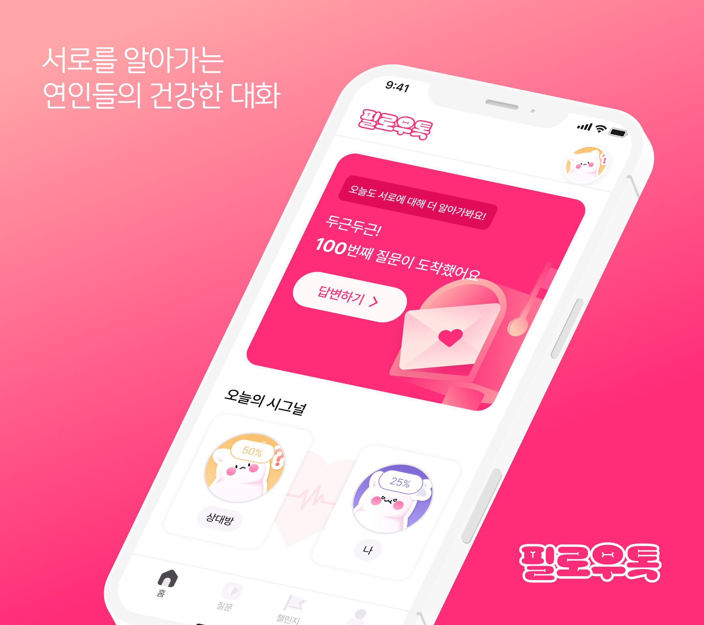
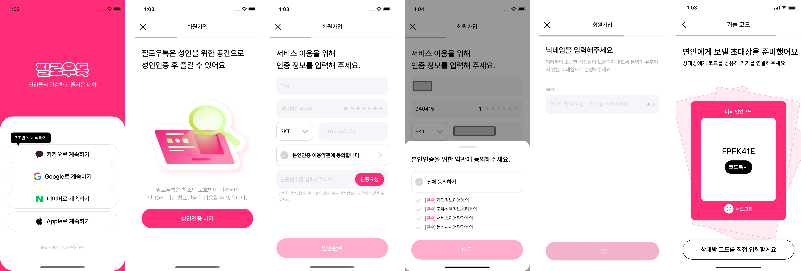
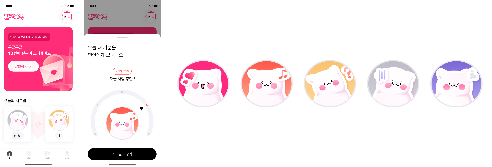
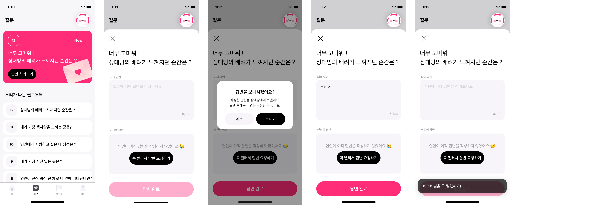
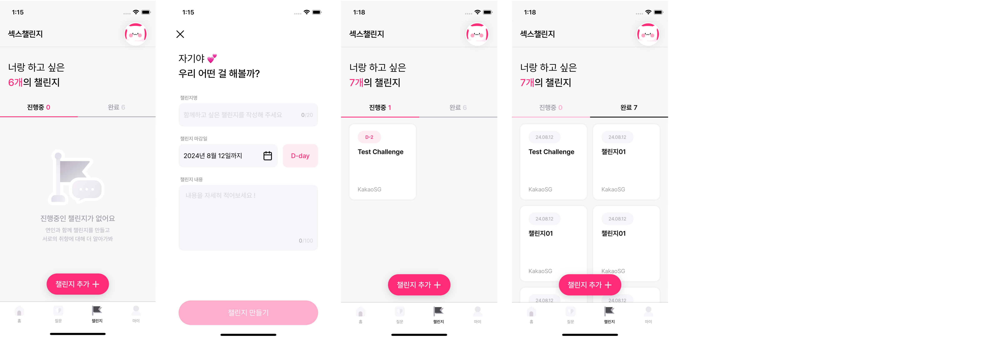
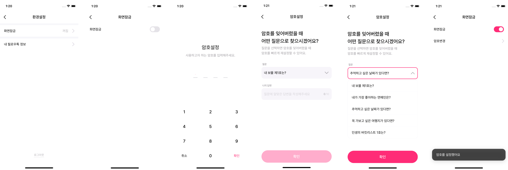
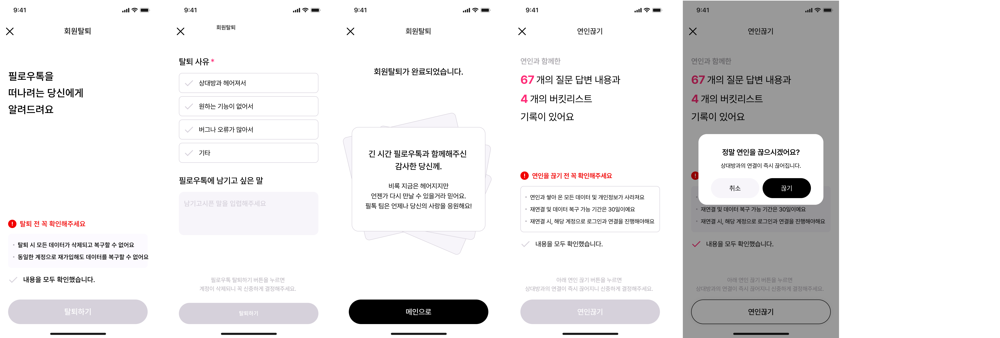
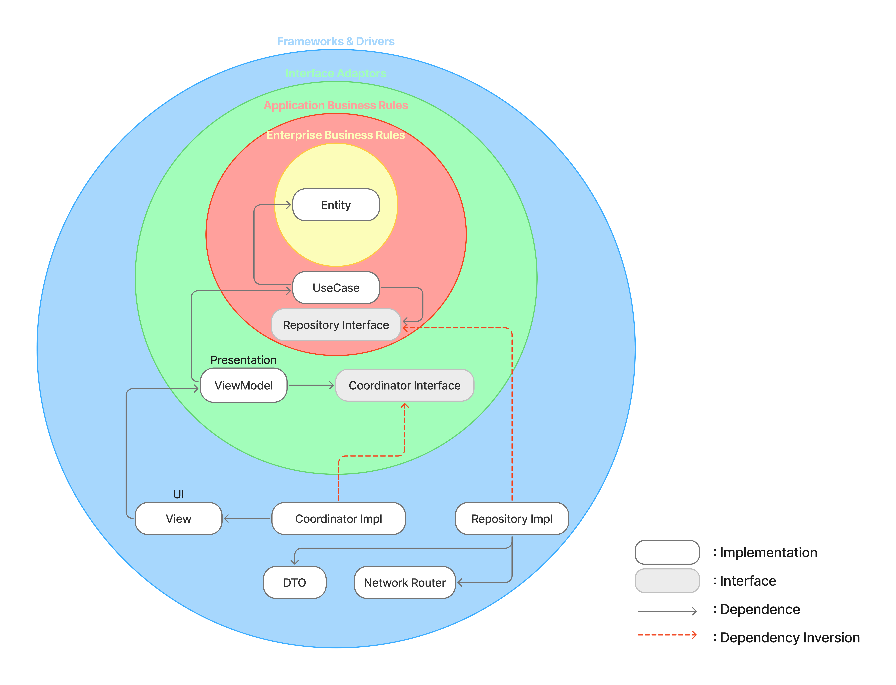

# 필로우톡(FeelTalk)
> 커플 간 감정 신호와 질문 기반 대화를 중심으로 한 iOS 커뮤니케이션 앱



## ⚠️ Project Status
현재 백엔드 서버가 종료되어 실제 네트워크 기능은 실행할 수 없습니다.   
앱스토어 배포도 종료된 상태입니다.   
본 저장소는 네트워크/아키텍처 설계와 구현 방식을 확인할 수 있도록 코드와 기술 문서를 공개합니다.   
  
<br>

## 👋 Introduce
💞 “자기는 이런게 좋아?”, “저런게 좋아?”  
연인 사이에서 이런 질문을 자연스럽게 나누기란 생각보다 쉽지 않습니다.

FeelTalk는 **연인들이 스킨십을 포함한 민감한 주제에 대해부담 없이 대화를 나눌 수 있도록 돕는 커플 커뮤니케이션 서비스**입니다.

<br>

## 📱 Screen
### 1. 회원가입 & 로그인

* 필로우톡은 소셜 로그인 기반 인증 구조를 사용하여 로그인과 회원가입을 하나의 플로우로 통합했습니다. 인증 성공 시 사용자 존재 여부에 따라 계정을 생성하거나 로그인 처리하여 초기 진입 과정을 단순화했습니다.
* 성인 대상 서비스 특성상 휴대폰 본인 인증을 필수 단계로 포함하고 있으며, 인증 상태에 따라 화면 전환 및 다음 단계 접근을 제어합니다.
* 본인 인증 이후에는 닉네임을 설정하고, 커플 서비스 특성을 반영한 코드 기반 사용자 연결 구조를 제공합니다.

### 2. 시그널 전송

* 시그널 전송은 사용자의 현재 기분 상태를 상대방에게 전달하고, 서로의 상태를 간단하게 확인할 수 있도록 설계된 핵심 서비스입니다.
* 사용자는 자신의 시그널을 선택할 수 있으며, 선택된 시그널은 서버에 저장되어 커플로 연결된 상대방에게 전달됩니다.

### 3. 오늘의 질문

* 오늘의 질문은 커플 간 대화를 자연스럽게 유도하기 위해 매일 새로운 질문을 랜덤하게 제공하는 커뮤니케이션 기능입니다.
* 사용자는 질문에 대한 답변을 작성하고, 답변은 커플 관계로 연결된 상대방과 공유됩니다.
* 상대방이 아직 답변하지 않은 경우, ‘꼭 찌르기’ 기능을 통해 가벼운 방식으로 응답을 요청할 수 있습니다.

### 4. 첼린지

* 챌린지 등록은 커플이 함께 목표를 설정하고, 일정 기간 동안 이를 공유·실천할 수 있도록 지원하는 서비스입니다.
* 사용자는 챌린지를 직접 생성하고, 진행 중 / 완료 상태에 따라 목록을 구분해 관리할 수 있습니다.
* 완료된 챌린지는 히스토리 형태로 확인할 수 있어, 커플 간의 공동 경험 기록으로 기능하도록 설계했습니다

### 5. 화면잠금

* 화면 잠금은 커플 서비스 특성상 발생할 수 있는 민감 정보 노출을 방지하기 위한 보안 기능입니다.
* 잠금 활성화 시 앱 진입 또는 포그라운드 전환 시 비밀번호 입력을 요구하여 개인정보를 보호합니다.
* 비밀번호 분실 상황을 대비해 보안 질문 기반 비밀번호 재설정 기능을 제공합니다.

### 6. 탈퇴 & 헤어지기

* 필로우톡은 계정 탈퇴와 커플 관계 해제(헤어지기)를 분리하여 제공합니다.
* 탈퇴 시 사용자 계정 및 관련 데이터가 삭제되며 복구할 수 없습니다.
* 헤어지기는 계정을 유지한 채 커플 관계만 해제하는 기능으로, 관계 해제 전 데이터 처리 범위를 명확히 안내합니다.

<br>

## 🛠️ Tech Stack
| **category** | **techStack** |
| --- | --- |
| **language** |  |
| **dependencyManagement** |  |
| **versionControl** | ,  |
| **architecture** | , ,  |
| **uiFramework** |  |
| **reactiveProgramming** | , , ,  |
| **layout** |  |
| **networking** |  |
| **oauthProviders** | , , ,  |
| **pushNotification** |  |
| **secureStorage** |  |

<br>

## 📐 Architecture


## 📂 Project Structure
```
FeelTalk
├── Presentation
│   ├── Challenge
│   │       ├── ChallengeViewController
│   │       ├── ChallengeViewModel
│   │       ├── ChallengeSubView
│   │       └── ChallengeCoordinator
│   ├── Chat
│   ├── Login
│   ├── Question
│   ├── Signal
│   ├── FCM
│   └── ...
│
├── Domain
│   ├── Entity
│   ├── Interface
│   │      └── Repositroy 
│   ├── UseCase
│   └── ...
│
├── Data
│   ├── Network
│   │   ├── Router
│   │   ├── DTO
│   │   └── APIService
│   └── Repository
└── App
```

### Clean Architecture
프로젝트의 유지보수성과 외부 변화에 대한 유연성을 확보하기 위해 Presentation, Domain, Data 3계층으로 분리하여 의존성 역전(DIP)을 적용했습니다.
* **Presentation Layer**: `View`, `ViewModel`, `Coordinator`로 구성됩니다. 비즈니스 로직을 배제하고 UI 업데이트와 화면 전환 흐름 처리에만 집중합니다.
* **Domain Layer**: `Entity`, `UseCase`, `Repository Interface`로 구성된 가장 독립적인 계층입니다. 어떤 외부 프레임워크나 다른 계층에 의존하지 않고 순수한 비즈니스 정책만을 가집니다.
* **Data Layer**: `Network`, `DTO`, `Repository Impl`로 구성됩니다. Domain 계층의 인터페이스를 채택하여 실제 API 통신을 수행하며, 응답된 DTO를 Domain Entity로 변환해 전달합니다.
  
🔗 [FeelTalk-Clean Architecture 리팩토링](https://tjdrb3807.github.io/study/ios/2026-02-24-iOS_FeelTalk_Clean_Architecture_Refactoring/)

### MVVM + RxSwift
UI 업데이트와 비즈니스 로직의 결합도를 낮추고 복잡한 비동기 이벤트를 효율적으로 제어하기 위해 MVVM 패턴과 RxSwift를 결합하여 도입했습니다.
* **Massive ViewController 방지**: `View`는 UI 업데이트와 사용자 이벤트 전달에만 집중합니다. 상태 관리와 비즈니스 로직을 `ViewModel`로 분리하여 View의 비대화를 방지했습니다.
* **Input-Output 인터페이스 규격화**: ViewModel의 인터페이스를 `Input`(View의 이벤트)과 `Output`(View로 방출할 상태)으로 분리했습니다. 이를 통해 모호해지기 쉬운 역할 경계를 캡슐화하고, 예측 가능한 **단방향 데이터 스트림**을 구축했습니다.
* **RxSwift 기반 비동기 스트림 제어**: API 통신, 사용자 입력 등 흩어지기 쉬운 비동기 이벤트를 단일 스트림으로 묶어 제어했습니다. 또한 `Driver`와 `Signal` 등 Traits를 활용해 메인 스레드에서의 안전한 UI 바인딩을 보장했습니다.

🔗 [FeelTalk-MVVM 패턴 도입기(with RxSwift)](https://tjdrb3807.github.io/study/ios/2026-01-01-iOS_FeelTalk_MVVM01/)<br>
🔗 [FeelTalk-MVVM 패턴 설계 전략(Input-Output)](https://tjdrb3807.github.io/study/ios/2026-01-01-iOS_FeelTalk_MVVM02/)<br>
🔗 [FeelTalk-MVVM 패턴 리팩토링](https://tjdrb3807.github.io/study/ios/2026-01-03-iOS_FeelTalk_MVVM03/)

### Coordinator Pattern
ViewController에 혼재되어 있던 UI 로직과 화면 전환(Navigation) 로직을 분리하고, 화면 간의 결합도를 낮추기 위해 Coordinator 패턴을 도입했습니다.
* **화면 전환 책임 분리**: `View`가 다음 화면을 직접 호출(push/present)하는 구조를 탈피했습니다. 화면 이동과 관련된 모든 책임과 흐름 제어를 독립적인 `Coordinator` 객체로 위임하여 단일 책임 원칙(SRP)을 강화했습니다.
* **사용자 상태 기반 라우팅**: 앱 진입 시 사용자의 인증 상태(로그인 여부, 온보딩 완료 여부 등)를 판별하여, **인증 플로우(Auth Flow)**와 **메인 서비스 플로우(Main Flow)**를 동적으로 분기하고 관리합니다.
* **의존성 주입(DI) 중앙화**: 각 화면 생성 시 필요한 ViewModel 등의 의존성 주입 과정을 Coordinator 내부에서 중앙 처리함으로써, 컴포넌트 간 결합도를 최소화하고 재사용성을 극대화했습니다.

### Router Pattern
네트워크 요청 구성을 별도의 책임 단위로 분리하고, 통신 레이어의 유지보수성을 높이기 위해 Alamofire 기반의 Router 패턴을 적용했습니다.
* **통신 레이어 추상화**: Repository 내부에서 URL, HTTP Method, Header, Parameter를 하드코딩하던 기존 방식은 엔드포인트가 증가할수록 중복 코드와 수정 비용을 증가시켰습니다. 
* **엔드포인트 중앙화**: 이를 해결하기 위해 30여 개의 API 엔드포인트를 하나의 `Router`로 구조화했습니다.
* **캡슐화를 통한 안정성 확보**: API 요청에 필요한 모든 상세 정보 구성을 Router가 전담(`URLRequestConvertible`)하도록 캡슐화하여, Repository가 세부 구현 방식에 의존하지 않는 안전한(Type-safe) 네트워크 환경을 구축했습니다.

🔗 [FeelTalk - Router 패턴 (with Alamofire)](https://tjdrb3807.github.io/study/ios/2026-01-04-iOS_FeelTalk_Network_Router/)


